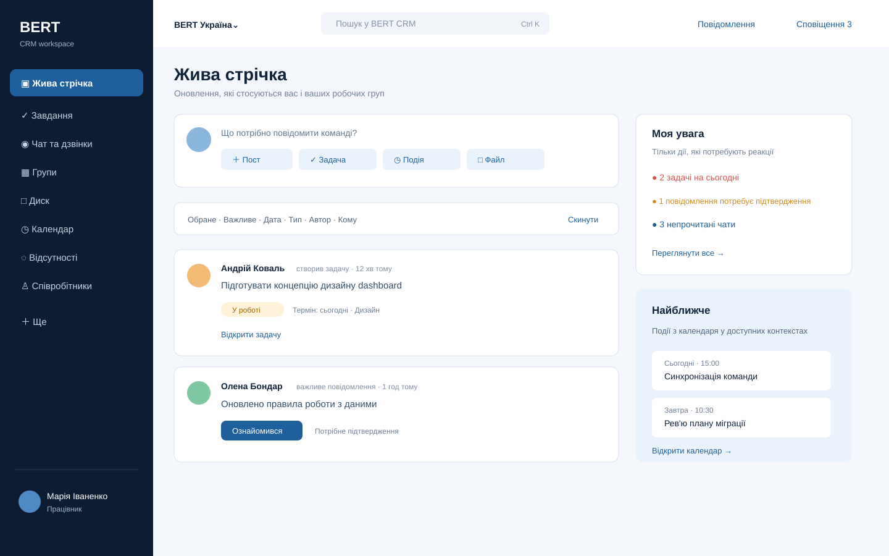
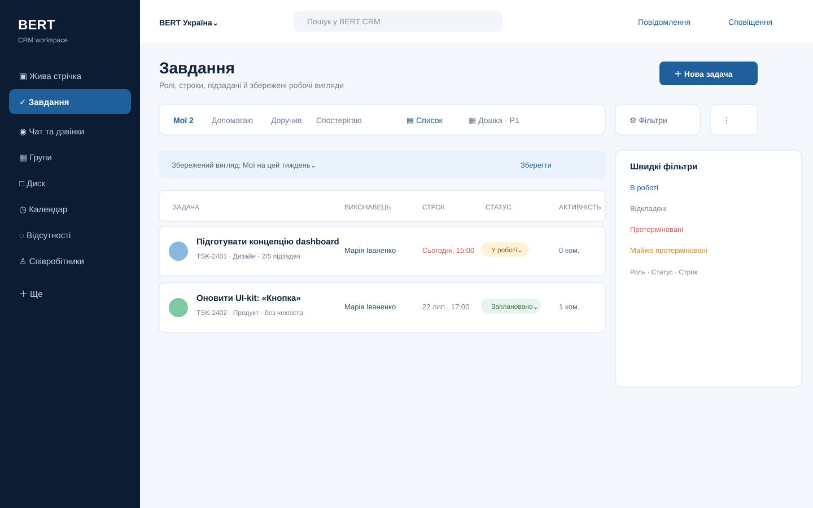
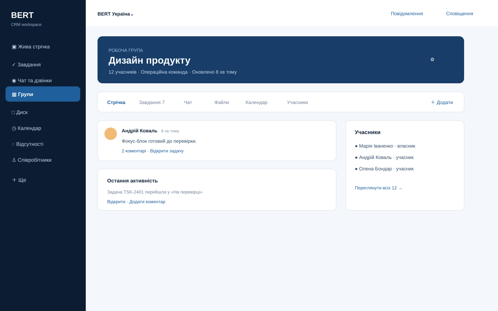
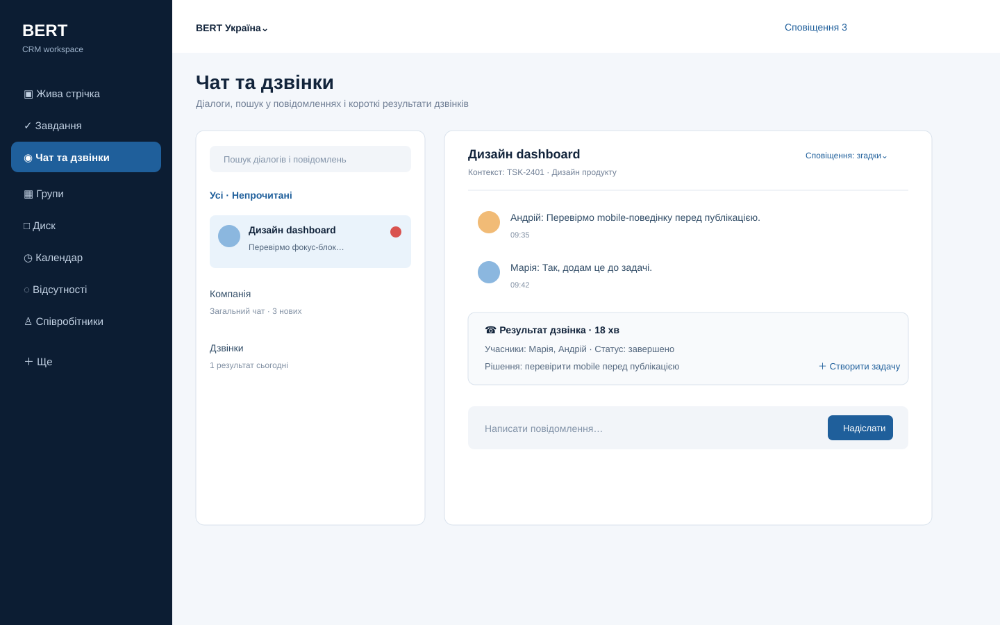

# План переносу робочого функціоналу Bitrix24 у LankaDWS

- **Версія:** 1.5 — implementation-aligned product/UI plan
- **Дата:** 2026-07-23
- **Статус:** робочий product/UI plan для scope, UX, domain/API contracts і user-facing acceptance; його рішення можна уточнювати за evidence та зручністю, якщо зміна зафіксована й узгоджена з backend data plan
- **Продукт:** LankaDWS — внутрішній operations workspace без sales CRM
- **Backend data plan:** [bitrix24-database-migration-plan.md](bitrix24-database-migration-plan.md)

**Межа evidence:** старий portal перевірявся лише читанням UI, metadata та агрегованими `SELECT`/`SHOW`; жодні дані, налаштування, права, повідомлення або файли на ньому не змінювалися. Поточна реалізація LankaDWS уже розвивається за цим планом; фактичний стан фіксують код, migration files, tests, [implementation checklist](implementation-checklist.md) і [decisions](decisions.md).

> Обидва плани є координованими робочими правилами, а не незмінною специфікацією. Зміни product scope, route, domain schema, permission або API мають бути відображені тут або в загальному Decision log; snapshot/export/import/reconciliation/cutover/rollback — у backend data plan. При суперечності обирається безпечніше й простіше для користувача рішення з явним записом причини.

## 0. Результат повторної перевірки

Попередня версія правильно визначала напрям, але спиралася переважно на меню, документацію Bitrix24 і стан репозиторію. У v1.3 додано read-only UI-аудит реального portal; у v1.4 перевірено схему й агреговані дані БД та виправлено:

| Знайдена проблема | Виправлення |
|---|---|
| Вимога підзадач була замінена checklist | Додано `Task.parentTaskId`, UX, API, import і acceptance для справжніх subtasks |
| `POST /feed/posts` не мав source-моделі | Додано `FeedPost`; `FeedItem` лишається read projection |
| План без потреби вводив `/feed` і `/communications` | Збережено чинні `/overview` і `/messages`; змінюються label/content |
| Feed P0 залежав від Groups P1 | Мінімальний group kernel перенесено перед Feed; повний UI груп лишився P1 |
| «Дзвінки» могли означати власну телефонію | V1 — call record/provider link; WebRTC/PSTN/recording/transcription поза scope |
| «Час і звіти» автоматично трактувався як task timer | Timer/workday/report discovery скасовано; D-009 зафіксував archive-only для старих Absences, без нового route |
| GET API використовував новий `companyId` | Збережено чинний query `company`; `companyId` — mutation body |
| Group privacy була надто грубою | Розділено discoverability та join policy |
| Calendar UI не мав моделей/API | Додано P1 contracts для participants/RSVP/recurrence/reminders |
| Були довільні 24 місяці, p95 500 ms і rollout 25% | Ці числа вилучено до вимірювання та бізнес-рішення |
| P0 вкладка «Спостерігаю» залежала від followers P1 | Мінімальні follow/unfollow піднято у P0; labels/board лишилися P1 |
| Join policy `REQUEST` не мав workflow | Додано `GroupJoinRequest`, стани, API та атомарні правила approve/reject |
| P1 routes могли з'явитися раніше готового UI | Додано company capability gate, controlled unavailable state й rollout rule |
| Offline та основні Feed/Chat journeys не мали однозначного acceptance | Зафіксовано v1 offline-контракт і Given/When/Then сценарії |
| Feed SVG рендерив лише shell, а Task rail/tabs не відповідали тексту | Замінено invalid SVG container, узгоджено labels/P0 tabs/330 px rail; усі чотири SVG візуально перерендерено |
| Важливе повідомлення трактувалося як звичайний unread item | Додано mandatory acknowledgement, окремий receipt, inbox «Потребує підтвердження» й acceptance |
| `TaskFollower` підміняв співвиконавців і спостерігачів | Додано окремі task roles; follower лишився notification subscription |
| Реальні task filters були описані надто загально | Зафіксовано legacy presets, role filter, saved/default views і URL-state як P0 transition contract |
| Org hierarchy було відкладено без usage evidence | Portal підтвердив велику ієрархію підрозділів та department-dependent UX; додано мінімальний `OrgUnit` kernel без HR dossier |
| «Час і звіти» планував зайві timer/workday/report models | Реальний portal показує графік відсутностей і порожній planner; candidate slice звужено до Absences, решта виключена без нових доказів |
| Не було transition contract для старих URL і персональних фільтрів | Додано allowlisted legacy-link resolver, content-link rewrite, saved-view compatibility report і read-only source banner |
| Admin view помилково міг вважатися доказом ACL coverage | Додано reconciliation за representative end-user principals; admin access не є evidence доступу користувача |

### Коротке рішення

LankaDWS переносить щоденне ядро в такому порядку: **Жива стрічка → Завдання → Чат → Співробітники/оргконтекст**. **Групи, Диск і Календар** підключаються поетапно після inventory; старі **Відсутності** лишаються archive-only за D-009. Встановлені, але непідтверджені модулі не потрапляють навіть у «Ще». Leads, deals, sales pipeline та зв’язок «компанія → лід → угода» не входять у модель. Одна сутність має одне джерело правди; feed, search і notifications є проєкціями.

## 1. Докази й перевірений поточний стан

### 1.1. Вхідний scope

- [Оригінальне меню Bitrix24](assets/bitrix24-migration/source-bitrix24-menu.png)
- [Поточний LankaDWS — Огляд](assets/bitrix24-migration/current-overview.png)
- [Поточний LankaDWS — Завдання](assets/bitrix24-migration/current-tasks.png)

`current-messages.png` не використовується як evidence: screenshot має зламаний viewport. Перед F0 sign-off сторінки треба перезняти в одному viewport 1440×900 із датою, роллю та company.

### 1.2. Факти репозиторію

| Шар | Перевірений стан | Наслідок |
|---|---|---|
| Web | React/Vite; routes — `apps/web/src/app/routes.ts`; shell — `apps/web/src/layout/AppShell.tsx` | Перевикористати company selector, global search, message/notification shortcuts і role-aware nav |
| API | NestJS + Prisma; bounded modules у `apps/api/src/modules/*` | Розширювати чинні `tasks`, `communication`, `calendar`, `employees`, `files/documents`; нові bounded modules — `feed`, `groups`; `absences` не створювати без нового рішення, backend import описаний окремо |
| Дані | SQLite; schema — `apps/api/prisma/schema.prisma` | Врахувати single-writer topology та чинну JSON-as-String convention |
| Contracts | `packages/contracts`; RFC 9457 і permissions уже існують | DTO/Zod/permissions спочатку додаються в shared contracts |
| Файли | `FileObject`, `FileLink`, `Document`, `DocumentVersion`, scanner/quarantine | Диск будується поверх цієї boundary, без другого file store |
| Надійність | `AuditEvent`, `OutboxEvent`, `BackgroundJob`, `IdempotencyRecord`, retention/legal hold | Перевикористати чинні патерни; не створювати дублікати платформ |

### 1.3. Перевірені чинні API

| Модуль | Уже є | Немає |
|---|---|---|
| Завдання | list/detail/create, status, comments, checklist, recurrence | full edit, subtasks, followers, labels, group scope, activity outbox |
| Повідомлення | list/detail/post, message→task | create thread, participants, read endpoint, attachments, realtime, calls |
| Календар | events/presence read | create/edit, participants, RSVP, recurrence, reminders |
| Документи/файли | list/detail/create/publish; upload/status/download | folder tree, move/share/preview, unified access service |
| Працівники | scoped list/detail і safe presence | manager/approver filters та active contexts; org units ще не змодельовані |
| Platform | notifications, saved views, search, analytics, audit/outbox/jobs | розширити, а не дублювати |

Чинні read endpoints використовують `?company=...`; mutation body — `companyId`. Це правило зберігається.

### 1.4. Офіційна перевірка Bitrix24

Перевірено 2026-07-22:

- [Feed](https://helpdesk.bitrix24.com/open/25601377/) містить posts, group/project updates, events, tasks і work reports; LankaDWS свідомо не переносить polls/workflows у feed v1.
- [Workgroups/projects](https://helpdesk.bitrix24.com/open/24633004/) мають public/private/hidden privacy, participants, tasks та archive; LankaDWS зберігає privacy semantics в одній сутності `Group`.
- [Task/event from message](https://helpdesk.bitrix24.com/open/25834615/) підтверджує потребу двостороннього deep-link.
- [Drive](https://helpdesk.bitrix24.com/open/25927659/) має folders, versions, permissions і recycle bin; LankaDWS P1 переносить потрібне ядро без public links за замовчуванням.
- [Worktime](https://helpdesk.bitrix24.com/open/24856218/) включає clock-in/out і daily reports; [task elapsed time](https://apidocs.bitrix24.com/api-reference/tasks/index.html) — окрема capability.
- [Task XLS export](https://helpdesk.bitrix24.com/open/26004483/) не доводить доступність comments/chats/files; повний import залежить від edition і REST scopes.
- [Chat history](https://apidocs.bitrix24.com/api-reference/chats/messages/im-dialog-messages-get.html) доступна в межах participant permissions; [workgroup list](https://apidocs.bitrix24.com/api-reference/sonet-group/socialnetwork-api-workgroup-list.html) також залежить від caller rights. F0 мусить довести coverage.

### 1.5. Read-only usage evidence

Перевірено 2026-07-22–23 на налаштованому `b24.lankadwscompany.org`. Аудит був суворо read-only: UI, metadata й агрегати; без зміни даних, налаштувань, прав, повідомлень або файлів. Персональний content і secrets у repo не копіювалися.

Product-релевантні висновки:

- Tasks, task discussions, Feed announcements/comments і Chat є живим щоденним ядром;
- chat history містить також великий пласт legacy system/task notifications, тому новий UI не повинен показати їх як дублікати людських повідомлень;
- read/mute, participant state, exact task roles і saved/default filters реально використовуються та входять у transition acceptance;
- org tree активна й потрібна для employee/task/group context;
- files і history мають великий обсяг, тому UI мусить мати cursor pagination, hot/archive та explicit unavailable states;
- Absences мають лише стару активність до липня 2023, тому route прихований, а default outcome — archive-only;
- tenant містить кілька legal/project branches; company boundary має бути підтверджена до показу imported content.

Точні schema, counts, canonical source tables, snapshot/export/import rules і reconciliation зберігаються тільки в [backend-плані переносу БД і файлів](bitrix24-database-migration-plan.md).


### 1.6. Product-висновки з реального використання

| Зона | Рішення | Доказ / спрощення |
|---|---|---|
| Жива стрічка | **KEEP P0** | Оголошення для аудиторій, важливі повідомлення, comments, files, reactions, favorite/follow і filters реально видимі; Company Pulse, Popular, app promos і print/theme chrome не переносяться |
| Завдання | **KEEP P0, поглибити** | Реальні roles: Мої / Допомагаю / Доручив / Спостерігаю; detail має responsible, co-executors, observers, deadline/overdue, reminder, important, favorite, checklist, files, comments, history |
| Чат | **KEEP P0, history tiering** | Потрібні search, direct/group/company thread, unread, notifications/mute і presence; calls лишаються evidence-gated |
| Співробітники | **KEEP P0 kernel** | Велика org tree, department filters, manager context, employee search і phone directory; HR dossier, honours/efficiency/personnel-news screens не переносяться |
| Групи | **SIMPLIFY P1** | Є open/request privacy, membership, favorite, files і posts; apps та непідтверджені вкладки не копіюються |
| Диск | **SELECTIVE P1** | Personal/shared/group scopes, folders, search, recycle та view modes потрібні; special/technical folders імпортуються лише approved rules |
| Календар | **READ-FIRST / P1 write** | Personal/company scopes і standard views зберігаються; write/RSVP/recurrence — після activity distribution |
| Час і звіти | **HIDE; ABSENCES ARCHIVE BY DEFAULT** | Є лише 204 absence records з останньою активністю в липні 2023; meetings list порожній, workday/task timer/narrative reports не підтверджені |
| Legacy processes та інше | **ARCHIVE/DROP** | Перевірені custom processes мають 0–2 записи з останньою видимою активністю 2019 року; CRM catalogs, wiki, photos, forum, ratings, marketplace/contact-center і polls не входять без owner + recent usage |

Ключове правило: installed module або admin menu item не є product requirement. Capability входить у release лише коли має business owner, recent usage, source coverage, target acceptance і migration/retention decision.

## 2. Product scope і пріоритети

### 2.1. Що переносимо

| Розділ | P0 — перший корисний реліз | P1 — після стабілізації | P2 / лише за usage evidence |
|---|---|---|---|
| Жива стрічка | posts, audience, comments/replies, attachments, mentions, **important acknowledgement**, unread, favorite/follow, minimal like, exact filters + saved/default views | item hide, category mute, extended reactions | polls, workflow launcher, Company Pulse/Popular widgets |
| Завдання | list/detail/create/edit, responsible, **co-executors**, **observers**, status, deadline, priority, reminder, important/favorite, checklist, **subtasks**, comment replies/files, recurrence, history, follow/unfollow, role presets + saved views | labels, board, configurable columns, safe bulk status | Gantt, Planner, efficiency score, robots/bulk automation |
| Чат та дзвінки | direct/group/context/company threads, unread, search, reply, attachments, mentions, notification mode, presence, message→task/event, live invalidation | pin, extended reactions; manual/provider call record only after evidence | native WebRTC/PSTN, recording, transcript |
| Групи | data/permission kernel для P0 context | list/detail, members, join requests, archive, privacy, posts/files; task/chat/calendar tabs only when enabled | apps, guests/collabs, unused tab parity |
| Диск | чинні documents/files та context links | selected personal/group/shared folders, versions, inherited ACL, preview, recycle/archive | public links, office editor, technical folders without owner |
| Календар | чинний privacy-safe personal/company read calendar | create/edit, participants/RSVP, recurrence, reminders after usage split | rooms, external guest email |
| Відсутності | export/archive + org dependency; route прихований за D-009 | read calendar лише якщо нове рішення замінить archive-only policy; write/approval — окремий acceptance | workday timer, task timer, narrative reports, legacy meeting planner |
| Співробітники | safe directory/profile + `OrgUnit` data kernel | org tree, department/manager/phone filters, allowed context links | HR dossier, efficiency, honours board, personnel event log |
| Ще | notifications and settings/admin only when already implemented and allowed | role-specific ordering | requests/knowledge/marketplace/business processes without owner/evidence |

### 2.2. Non-goals

- leads, deals, sales pipeline, customer CRM cards і sales automation;
- native telephony/video, recording, speech-to-text та AI call summary у v1;
- feed polls/workflows, Gantt/Planner, office editor;
- Company Pulse, Popular, mobile/desktop app promos, honours/efficiency/rating widgets;
- legacy meeting planner, wiki, forum, photos, CRM catalogs, marketplace/contact-center and dormant custom processes;
- автоматичне розширення file ACL усім chat participants;
- sales archive без окремої legal/security вимоги;
- workday/task timers, narrative reports, shift scheduling/payroll/violations до нового підтвердження використання;
- дублювання task/message/file як нового самостійного feed object.

## 3. Цільова навігація та UX

### 3.1. Стабільні routes

| Label | Canonical route | Правило |
|---|---|---|
| Жива стрічка | `/overview` | Поточний dashboard замінюється feed; `/feed` не вводиться |
| Завдання | `/tasks` | Чинні detail/new routes зберігаються |
| Чат та дзвінки | `/messages` | Calls — filter/cards у цьому module; `/communications` не вводиться |
| Групи | `/groups` | Короткий nav label; page heading «Робочі групи» |
| Диск | `/drive` | Folder UX; `/documents` лишається logical document deep-link/editor |
| Календар | `/calendar` | Чинний route |
| Відсутності | `/absences` | Route не реєструється за D-009; можливий лише після нового рішення. Старі `/time`/Bitrix timeman patterns обробляє legacy resolver, а label «Час і звіти» лишається тільки в transition help |
| Співробітники | `/employees` | Чинний route |
| Ще | menu/sheet | Desktop popover; mobile full-height sheet; тільки дозволені routes |

`company`, `view`, `filter`, `cursor` зберігаються в URL. `groupId` — path `/groups/:groupId` або query filter shared endpoint. Back/Forward та refresh не втрачають стан. Topbar message/notification icons — shortcuts із badge, не другий текстовий nav.

Global `Ctrl/Cmd+K` є робочою палітрою, а не окремим search module: без запиту вона показує лише дозволені швидкі переходи, від двох символів — згруповані результати Tasks, Requests, Groups, Chat, Drive, Employees, Calendar і Knowledge. Backend повторно застосовує company scope, permissions, document/article ACL та live group/thread membership; snippets не містять message body або іншої чутливої preview-інформації. Палітра підтримує debounce, стрілки/Enter/Esc, focus trap і повноекранний mobile state.

Notification center лишається єдиною LankaDWS-native чергою: «Потребує дії» містить лише непрочитані actionable items, окремо доступні «Непрочитані», «Згадки» та «Усі». Користувач може відкрити allowlisted canonical target, змінити read state одного item або позначити видиму чергу прочитаною; topbar показує реальний unread count. Читання сповіщення не змінює сам Task/Request/Feed aggregate, тому робочий статус завжди лишається у canonical module.

Chat unread summary є окремим lightweight read без message body та user profiles. Він повторює company/participant/live-group authorization і живить однаковий badge у sidebar, topbar та mobile nav. Відкритий thread використовує SSE invalidation; 15-second foreground polling списку лишається тільки fallback, доки SSE не підключений або діалог не відкритий.

Topbar має одну dominant action «Створити», яка за поточними permissions і company capabilities веде до наявних форм Task, Chat, Calendar Event, Request, Group, Drive upload або Announcement. Ті самі дії є першою групою в `Ctrl/Cmd+K`; drawer-based modules приймають URL state `new=1`, одразу прибирають його після відкриття й коректно вибирають реальну enabled company при `company=all`. Окремі дубльовані форми у shell не створюються.

Existing Requests лишаються compact workflow, а не окремим BPM-конструктором. URL зберігає company/tab/page/search; list показує автора або погоджувача, SLA-overdue state, stable segment counts і responsive pagination. Company-wide metadata доступна лише `confidential.hr.read`, узгоджено з detail ACL. Повернена absence request повторно відкриває canonical three-step wizard з останнього safe snapshot; author може cancel, approver — approve/return/reject, а negative decision вимагає comment.

Кожен route має server-backed company capability code та permission metadata. Sidebar показує пункт лише коли capability увімкнена для company і permission дозволена. F1 реєструє стабільні routes, але `/groups`, `/drive` і `/absences` приховані від звичайних users до відповідних F4/F5 exit gates; direct URL показує контрольований `MODULE_NOT_ENABLED` state без частково працездатного UI, а data API повертає RFC 9457 403 `CAPABILITY_DISABLED`. Existing `/overview` є винятком: доки `FEED` disabled, він лишає чинний dashboard; після F2b exit capability атомарно перемикає content на Feed. Existing `/messages` і `/calendar` так само не втрачають чинний read UX, а лише приховують нові Calls/write controls до capability. Pilot увімкнення виконується per-company після exit gate. До F4 group context у P0 показується як label/read-only popover без переходу у незавершений Groups UI.

Для `company=all`, `effectiveCompanyIds(capability) = principal.allowedCompanyIds ∩ enabledCompanyIds(capability)`. Nav/module активний, якщо set не порожній; API list/count/mutation працюють лише по effective set. Mixed rollout не вимикає весь module: UI показує «увімкнено для N із M доступних компаній» і не підмішує data disabled companies. Cursor/realtime scope bind-иться до sorted `(companyId,capabilityVersion)`; зміна set/version вимагає reset/refetch. Для `/overview`, якщо effective `FEED` set порожній, лишається legacy dashboard.

#### 3.1.1. Transition compatibility і legacy links

Перехід має бути знайомим, але не копіювати Bitrix chrome:

- перші чотири desktop nav items і mobile core повторюють mental order: Стрічка → Завдання → Чат → Календар; Groups/Drive/Employees лишаються в тому самому vocabulary;
- протягом validation window shell показує non-blocking banner «Стара CRM доступна лише для читання» з link на transition guide, не на довільний legacy URL;
- help sheet містить mapping старої назви/іконки до нового route та короткі tooltips лише для першого входу;
- personal sidebar order, themes, Company Pulse widgets і admin favorites не імпортуються; default role nav однаковий і передбачуваний;
- saved filters/default views імпортуються лише коли всі referenced fields/operators мають canonical mapping; решта потрапляє у compatibility report з назвою filter, owner та причиною, без silent approximation;
- old notification queue/system toasts не з'являються як нові notifications. Після переходу notification center створює лише LankaDWS-native actionable events; chat і mandatory inbox мають окремі badges;
- links у historical post/task/comment/message bodies проходять allowlisted backend legacy-link resolver; user ніколи не redirect-иться на arbitrary URL.

`LegacyLinkResolver` приймає лише відомі Bitrix patterns для task, post/comment, group, user, file/document і calendar event. Resolver нормалізує source tenant + numeric ID, повторно авторизує target і робить 302 на canonical LankaDWS route. Невідомий pattern не стає open redirect; повертається safe 404 з link на search. Старий portal у read-only window або окремий `/legacy/bitrix/resolve` entry point використовує той самий mapping. Embedded file download URLs не переписуються на public links.

### 3.2. Layout і accessibility

- Desktop ≥1280: sidebar 248 px, topbar 76 px, content flexible; right rail 300–350 px лише якщо має окрему цінність.
- 768–1279: sidebar 72 px/collapsible; right rail під content; detail drawer 480 px.
- Mobile 390: bottom nav — Стрічка, Завдання, Чат, Календар, Ще; detail full-screen; rows стають cards.
- Page-level horizontal scroll заборонений; data-grid scroll дозволений лише всередині grid.
- WCAG AA, target 44×44, visible focus, `aria-current`, drawer focus trap/return, `aria-live`, reduced motion.
- Existing dashboard до atomic `FEED` switch лишається робочим, але його first viewport є task-first: status → один next step → одна primary action; supporting counts ведуть у canonical lists, а всі внутрішні переходи зберігають effective `company`, навіть якщо login відкрив `/overview` без query.
- Admin overview не показує декоративний hero або zero-count warning rows: найризиковіший non-zero blocker стає єдиною primary action, решта лишається згрупованим supporting context. Images у щільних authenticated screens додаються лише коли передають інформацію, а не займають місце роботи.

**Offline v1 contract:** offline mutation queue і background sync відсутні. Останній уже завантажений in-memory read state можна показати зі stale/offline banner і часом оновлення; всі mutation controls disabled. Незавершений feed/message/task draft лишається в пам'яті поточної вкладки під час reconnect, але не обіцяється після reload/закриття вкладки й не записується у persistent browser storage. Якщо мережа зникла під час submit, текст і attachments selection не очищаються; після reconnect user натискає явний Retry. Offline refresh без cache показує окремий offline state.

### 3.3. Жива стрічка

Одна основна точка створення — composer. Default action створює post. Secondary actions «Задача» і «Подія» відкривають canonical forms і після save повертають у feed; poll/workflow не показуються. Global `+` відкриває той самий entry point; дубль quick-create у right rail не потрібен.

Feed post: actor, audience, time, group/context, body, attachments, mentions, comments, stable link, `requiresAcknowledgement`, edit/archive policy. Projection задачі/файла/події/оголошення не редагується в feed — відкриває source.

P0 filter bar повторює звичну семантику, але в компактному facet UI: **Обране, Важливе, Дата, Тип, Автор, Кому/аудиторія**. Query/chips зберігаються в URL; user може зберегти view і зробити його default. «Скинути» повертає module default, а не видаляє saved view.

Mandatory announcement не дорівнює unread. Відкриття item або scroll не підтверджує ознайомлення. Authorized recipient натискає явне «Ознайомився»; receipt immutable, показує timestamp user-у, а author/moderator бачить aggregate acknowledged/required і permission-scoped список. Edit після першого acknowledgement створює new acknowledgement version лише якщо author явно обирає «потрібне повторне підтвердження».

Коментарі P0 мають flat reply (`replyToCommentId` + preview), mentions і attachments; довільна глибока tree не потрібна. Author/commenter/mentioned user автоматично підписується на thread, але може «Не стежити» без втрати access. Minimal like входить у P0 для transition parity; extended emoji — P1.

**Relevance:**

- company feed: addressed posts, mentions, assignment, blocked/overdue, announcements, events, explicitly shared files;
- group feed: group posts і значущі group events;
- звичайний `message.created` та кожен `task.commented` не потрапляють у global feed;
- повторні технічні зміни source агрегуються;
- P1: user може hide/mute category, але не mandatory announcement;
- усе до canonical `feedCutoverAt` стартує read.

Unread — monotonic cursor. «Позначити все прочитаним» записує останній видимий item; старі записи, які стали видимими пізніше, не створюють unread flood.

Desktop attention rail містить лише actionable blocks: «Потребує підтвердження», «Мої прострочені/майже прострочені задачі» і optional people events. Company Pulse, Popular, app download і birthdays-as-feed не повертаються; birthdays можуть бути окремим compact Employees widget P1.

### 3.4. Завдання і підзадачі

P0 tabs зберігають звичні ролі: **Мої** (responsible), **Допомагаю** (co-executor), **Доручив** (creator), **Спостерігаю** (observer). **Командні/Усі** — лише з permission. Observer є task participant з read/notification semantics; follower — окрема subscription для user, який уже має access. Вони не взаємозамінні.

P0 quick presets: **В роботі, Відкладені, Протерміновані, Майже протерміновані**. Advanced filters: role, status, due range, priority, group/project, responsible, creator, co-executor, observer, tag and text. Filter state, sort і visible columns мають URL/saved-view contract; P0 переносить valid saved/default views, P1 додає drag/configurable columns.

Task detail: title, description, group, creator, responsible, co-executors, observers, deadline/timezone, priority, status, block reason, reminder, personal important/favorite state, checklist, **subtasks**, files, source links, activity, comments/replies/attachments, recurrence. Tabs «Коментарі / Історія / Файли» можуть бути merged у один activity stream з typed filter, але data і stable anchors не втрачаються. Task time, remarks/evaluation і robots не входять без distribution + owner.

Checklist item — простий пункт. Subtask — повний `Task`. V1 дозволяє один рівень. Child успадковує workspace/company/group, але має власні assignee/status/deadline/comments. Cycle, child-of-child і cross-company/group parent заборонені. Parent не переходить у `DONE` з active children: API повертає 409 + blocker IDs. Progress — `done/total`.

Board, safe bulk status, configurable columns і advanced labels — P1. Gantt, My plan, task calendar duplicate і «ефективність %» не входять.

### 3.5. Чат та дзвінки

P0 — chat:

- create direct/group/context thread, manage participants; optional COMPANY thread has server-managed membership from active users and cannot be manually widened across companies;
- list search, in-thread search, ALL/UNREAD filter, unread/read, reply, edit/delete own message, attachments, mentions;
- per-thread notification mode `ALL|MENTIONS|NONE`, pin P1, safe online presence from existing presence service;
- message→task/event із двостороннім `EntityLink`;
- direct chat participant пропонується як follower; великі chats не додають усіх observers без review;
- REST mutation + scoped SSE invalidation; fallback refetch 15 s.

P1 calls: manual/provider card, participants, start/end/duration/status/summary/next action. «Подзвонити» відкриває configured provider link. Recording/transcript не зберігаються.

Через підтверджений великий обсяг history list/detail/search мають cursor pagination і bounded indexes; offset pagination та client-side full-thread load заборонені. Exact volume/classification зберігається в [backend data plan](bitrix24-database-migration-plan.md#44-chats). D-020 обирає full hot import або hot window + ACL-protected legacy archive. Thread metadata, participants, last-message, read cursor, edited/deleted markers, mute mode і attachment links не можна обрізати незалежно від body history window.

### 3.6. Групи

Base tabs: Основне/Стрічка, Файли, Повідомлення, Учасники. Завдання, Чат і Календар з'являються лише коли group usage inventory та company capability підтверджують модуль. Вони використовують shared endpoints із `groupId`, не копіюють data. Marketplace/apps tab не переноситься. List підтримує search, active/archive, favorite, member count і privacy/join badge.

Privacy:

- `discoverability: LISTED | HIDDEN`;
- `joinPolicy: OPEN | REQUEST | INVITE_ONLY`.

Roles: `OWNER | MODERATOR | MEMBER`. External guest — окреме майбутнє рішення. Archive робить group read-only, прибирає з default list і зберігає history/deep links.

### 3.7. Диск

P1: Мої / Групи / Спільні, tree, breadcrumbs, upload, folder create, move, rename, versions, preview, archive/recycle, search. Group/folder ACL успадковується, але download повторно перевіряє principal і `scanStatus=CLEAN`.

Source scopes мапляться явно: personal user disk, company shared disk, group disk, management/special library. «Усі документи» є authorized projection, не окремим storage. Mail/import/temp folders і attachment-only objects проходять owner/usage rules; folder name не є достатньою підставою для exclusion. Backend inventory/type/version/hash/ACL rules зберігаються тільки в [data plan](bitrix24-database-migration-plan.md#45-files-and-disk).

Якщо attachment недоступний частині participants, UI пропонує: явно надати доступ, вибрати інший файл або скасувати. Silent ACL expansion заборонений.

### 3.8. Календар

P0 зберігає чинний privacy-safe read calendar із personal/company source distinction та views День/Тиждень/Місяць/Розклад. P1 додає create/edit/cancel, attendees, RSVP, RRULE recurrence, reminders, location/conference link, group/task link після distribution by owner/type/last activity. Private event повертає сторонньому user лише busy interval.

### 3.9. Час і звіти

За D-009 route не реалізовується; historical absences доступні лише як migration archive. Перевірений portal показує **графік відсутностей** зі старою активністю та порожній список **зібрань/планерок**. Якщо Product пізніше доведе current owner і живий flow, нове рішення може додати label **Відсутності**, а meetings однаково обслуговує Calendar. Exact archive extraction описує backend data plan. Workday, task timer і narrative reports не входять у current release.

### 3.10. Співробітники

P0 лишає safe directory/profile і додає data-only `OrgUnit` kernel, бо org hierarchy потрібна для import, department filters і typed manager scope. P1 UI має searchable org tree, department/manager filters і context actions: canonical direct chat, preselected task assignee та title-prefilled calendar time block. Ці entry points повторно застосовують permission/company capability, не дублюють форми й не стверджують attendees/RSVP, яких Event model ще не має. Birthday може бути optional people event; кадрові зміни, efficiency, honours board і HR dossier не переносяться. HR/security fields не входять у public DTO/search snippet.

### 3.11. Ілюстративні макети

SVG нижче — оновлені v1.3 desktop concepts, не pixel-perfect acceptance і не нормативні щодо data. Вони вже фіксують portal-audit corrections: Feed — exact facets + mandatory acknowledgement; Tasks — Мої/Допомагаю/Доручив/Спостерігаю; Chat — search/unread/company thread/notification mode. Task SVG показує 330 px attention rail, але не detail/subtasks drawer. F0 ще має додати mobile 390 layouts для Feed, Task detail/subtasks і Chat та окремий desktop Task detail drawer. До цього SVG можна використовувати як reference для shell та information architecture, але не як interaction/accessibility acceptance.

Нормативні v1.3 layout sketches для наступного visual pass:

```text
FEED DESKTOP
┌ Sidebar ─────────┬ Header: company | global search | Chat badge | Ack/Notifications badge ┐
│ Жива стрічка     │ Жива стрічка                                      [Створити ▾]        │
│ Завдання         │ Composer: post | задача | подія | attachment                           │
│ Чат              │ [Обране] [Важливе] [Дата] [Тип] [Автор] [Кому] [Saved view ▾]          │
│ Групи / Диск     ├───────────────────────────────────────────┬─────────────────────────────┤
│ Календар         │ post / source card                        │ Потребує підтвердження      │
│ Співробітники    │ IMPORTANT • audience • time               │ Прострочені / майже строк   │
│ Ще               │ body + files                              │ optional people events     │
│                  │ [Ознайомився] [Коментар] [Like] [Стежу]   │                             │
└──────────────────┴───────────────────────────────────────────┴─────────────────────────────┘
```

```text
TASKS DESKTOP
┌ [Мої] [Допомагаю] [Доручив] [Спостерігаю] [Командні*] ─ [Нова задача] ┐
│ [В роботі] [Відкладені] [Протерміновані] [Майже протерміновані]       │
│ Search | Role/Status/Due/Group/People facets | Saved view | Columns* │
├─────────────────────────────────────────────────┬─────────────────────┤
│ title | role chips | responsible | due | status  │ Моя увага           │
│ subtask progress | comments/files | updated      │ today / overdue     │
│ ...                                             │ reminders           │
└─────────────────────────────────────────────────┴─────────────────────┘
Detail opens in 480 px drawer: creator → responsible → co-executors → observers,
description, reminder, checklist, subtasks, files, then one typed Activity stream.
```

```text
CHAT DESKTOP
┌ Threads 320 px ──────────┬ Conversation ────────────────────┬ Details 280 px* ┐
│ Search                   │ title • presence • [Mute ▾]      │ participants    │
│ [All] [Unread]           │ reply/context/attachment stream  │ linked task     │
│ company / direct / group │ [message input] [attach] [send]  │ shared files    │
└──────────────────────────┴───────────────────────────────────┴─────────────────┘
Older result opens an explicit authorized archive context; it never silently vanishes.
```

`*` — permission/capability/P1 gated. На mobile: tabs стають horizontal scroll, facets — bottom sheet, rail blocks — над list, task/chat detail — full screen.

<details>
<summary>Жива стрічка</summary>



</details>

<details>
<summary>Завдання</summary>



</details>

<details>
<summary>Робоча група</summary>



</details>

<details>
<summary>Чат та журнал дзвінків</summary>



</details>

## 4. Цільова доменна модель

### 4.1. Загальні правила

- `workspaceId` і `companyId` — authorization scope company data.
- Core relations мають typed FK; `EntityLink` — canonical cross-module relation.
- JSON зберігається як validated `String` з суфіксом `Json`, відповідно до чинної SQLite schema.
- Aggregate mutation використовує `expectedVersion` у body. `If-Match` не вводиться без окремого contracts/CORS update.
- LankaDWS генерує `TSK-*`/`DOC-*`; legacy Bitrix ID доступний через stable backend source mapping, бо може конфліктувати між portals.

`CompanyCapability`: `id`, `companyId`, `code FEED|GROUPS_UI|DRIVE|CALENDAR_WRITE|CALLS|ABSENCES`, `enabled`, `enabledById?`, `enabledAt?`, `disabledAt?`, `version`, timestamps; unique company/code. Capability є deployment/product gate поверх permission, не заміною RBAC. Server guard читає current value або cache keyed by company/code/version; client/session value не є authorization evidence.

`RealtimeInvalidation`: `sequence Int` auto-increment primary key, `outboxEventId` unique, `workspaceId`, `companyId`, `type`, `entityId`, `createdAt`, `expiresAt`. Outbox worker вставляє safe invalidation idempotently; SSE `id` = decimal `sequence`, не UUID. Expiry береться з чинного `RetentionPolicy(category=REALTIME_INVALIDATION)`; payload не містить body/PII.

### 4.2. Groups kernel

`Group`: `id`, `workspaceId`, `companyId`, `key`, `name`, `description?`, `discoverability`, `joinPolicy`, `status ACTIVE|ARCHIVED`, `ownerId`, timestamps, `archivedAt?`, `version`. Unique `(companyId,key)`; indexes `(companyId,status,updatedAt)`, `(ownerId,status)`.

`GroupMember`: `id`, `groupId`, `userId`, `role OWNER|MODERATOR|MEMBER`, `notificationMode ALL|MENTIONS|NONE`, `joinedAt`, `leftAt?`, `lastSeenAt?`, `version`. Unique `(groupId,userId)`; indexes `(userId,leftAt)`, `(groupId,role,leftAt)`.

`GroupJoinRequest`: `id`, `groupId`, `requesterId`, `status PENDING|APPROVED|REJECTED|CANCELLED`, `activeKey?` unique, `decidedById?`, `decidedAt?`, `createdAt`, `updatedAt`, `version`. Для `PENDING`, `activeKey="{groupId}:{requesterId}"`; у terminal state він `null`. Так DB гарантує лише один active request на group/requester; повтор із тим самим idempotency key повертає той самий result, а новий request за наявного pending — 409.

Allowed privacy pairs: `LISTED+OPEN`, `LISTED+REQUEST`, `HIDDEN+INVITE_ONLY`; інші combinations відхиляються. Owner і active `GroupMember(role=OWNER)` створюються atomically; active owner рівно один.

### 4.3. Feed source/projection

`FeedPost`: `id`, `workspaceId`, `companyId`, `groupId?`, `authorId`, `body`, `status DRAFT|PUBLISHED|ARCHIVED`, `requiresAcknowledgement`, `acknowledgementVersion Int`, `publishedAt?`, `editedAt?`, `archivedAt?`, timestamps, `version`.

`FeedPostRecipient`: `id`, `postId`, `principalType USER|GROUP|COMPANY`, `principalId`, unique post/principal.

Attachments — `FileLink(entityType=FEED_POST)`; чинний `Comment` для `FEED_POST|TASK` отримує `replyToCommentId?` self-link depth 1; comment attachments — `FileLink(entityType=COMMENT)`.

`FeedAcknowledgementRecipient`: `id`, `postId`, `acknowledgementVersion`, `userId`, `requiredAt`, unique post/version/user. Audience expansion створюється atomically з publish/re-ack version; подальша зміна company/group membership не переписує historical denominator.

`FeedPostAcknowledgement`: `id`, `postId`, `acknowledgementVersion`, `userId`, `acknowledgedAt`, unique post/version/user. Receipt не видаляється при edit/archive; повторне acknowledgement тієї самої version — idempotent і вимагає matching required recipient.

`FeedSubscription`: `id`, `postId`, `userId`, `notificationMode ALL|MENTIONS|NONE`, `createdAt`, `updatedAt`; unique post/user. Author, commenter і mentioned user отримують subscription за правилами service, але можуть змінити mode.

`FeedFileShare`: окремий explicit ACL source для standalone File-card: `id`, `workspaceId`, `companyId`, `fileId`, `ownerId`, `audienceType COMPANY|GROUP|USER`, `audienceKey`, `groupId?`, `status ACTIVE|REVOKED`, `version`, timestamps. Direct users зберігаються в `FeedFileShareRecipient`; attachment `FileLink` ніколи не створює цей source неявно. Feed і download повторно перевіряють current share audience, company access та scanner state; revoke не видаляє audit history, але одразу прибирає картку й доступ recipient.

`FeedItem`: `id`, `workspaceId`, `companyId`, `groupId?`, `actorId?`, `sourceType POST|TASK|MESSAGE|GROUP|FILE|EVENT|ANNOUNCEMENT|CALL`, `sourceId`, `action`, `eventKey` unique, `visibility COMPANY|GROUP|PARTICIPANTS`, `safePayloadJson`, `occurredAt`, `createdAt`, `archivedAt?`. Indexes company/time/id, group/time/id, actor/time/id.

`FeedReadCursor`: `id`, `userId`, `companyId`, `streamKey`, `lastReadAt`, `lastReadItemId`, `updatedAt`; unique user/company/stream.

`Mention` P0: `id`, source type/id, mentionedUserId, createdById, notifiedAt?, unique source/user. `Reaction` P0 підтримує лише `LIKE`; P1 розширює allowlist emoji. Поля: `id`, source type/id, userId, emoji, unique source/user/emoji.

`FeedUserItemState` P1: `id`, `userId`, `feedItemId`, `hiddenAt?`, `favoritedAt?`, timestamps; unique user/item. `FeedCategoryPreference` P1: `id`, `userId`, `companyId`, `category TASK|MESSAGE|GROUP|FILE|EVENT|CALL`, `mutedAt`, timestamps; unique user/company/category. `ANNOUNCEMENT` server-side не приймається як muted category.

`FeedItem` — immutable safe projection. Edit/archive post змінює `FeedPost`; worker idempotently materializes projection by source version.

### 4.4. Tasks

До `Task` додаються `groupId?`, `parentTaskId?` self-relation + index, `blockReason?`, `completedAt?`.

`TaskParticipant`: `id`, `taskId`, `userId`, `role CO_EXECUTOR|OBSERVER`, `addedById`, `addedAt`, `removedAt?`; partial unique index `(taskId,userId,role) WHERE removedAt IS NULL`. `Task.assigneeId` лишається єдиним responsible, `createdById` — creator. Importer мапить legacy member type explicitly; unknown type — issue, не follower fallback.

`TaskFollower`: `id`, `taskId`, `userId`, `createdAt`, `mutedAt?`; unique task/user.

`TaskUserState`: `id`, `taskId`, `userId`, `favoritedAt?`, `important`, timestamps; unique task/user. `TaskReminder`: `id`, `taskId`, `userId`, `remindAt`, `status ACTIVE|SENT|CANCELLED`, timestamps; index user/status/remindAt.

`TaskLabel`: `id`, `companyId`, `name`, `color`, `createdById`, timestamps; unique company/name. `TaskLabelAssignment`: `id`, `taskId`, `labelId`; unique task/label. Labels — P1.

`sourceMessageId/sourceCallId` у Task не додаються: чинний `EntityLink` уже вирішує зв’язок.

### 4.5. Messages/calls

`MessageThread`: додати `groupId?`, `directKey?` unique і `contextKey?` unique; нормалізувати `kind` до `DIRECT|GROUP|CONTEXTUAL|COMPANY` після migration чинних string values. `directKey` = company + sorted IDs рівно двох participants; `contextKey` = company + allowlisted entity type/id, тому canonical direct/context thread не дублюється. COMPANY thread має unique company key і server-managed membership. `ThreadParticipant.role` нормалізується до `OWNER|MEMBER`, додає `notificationMode ALL|MENTIONS|NONE`: DIRECT має immutable pair MEMBER, GROUP/CONTEXTUAL creator = OWNER і завжди мають щонайменше одного active owner. Existing `lastReadMessageId` використовується read endpoint. `ThreadUserState` P1 додає pin; mute вже покриває participant notification mode. Attachments — `FileLink(entityType=MESSAGE)`.

Нові threads завжди мають `companyId`. Чинні rows із `companyId=null` до посилення constraint проходять participant/company backfill, після чого backfill `directKey/contextKey`. Неоднозначна company або duplicate canonical key стає blocking migration issue; unique constraints не застосовуються, доки explicit merge/mapping і participant/message/read reconciliation не дають zero duplicates.

`CallRecord` P1: `id`, `workspaceId`, `companyId`, `groupId?`, `threadId?`, `provider`, `providerCallId?`, `direction`, `status`, `startedAt`, `endedAt?`, `durationSec?`, `ownerId`, `summary?`, `nextAction?`, `providerDiagnosticsJson?`, timestamps, `version`. Indexes company/start, thread/start, provider/providerCallId.

`CallParticipant`: `id`, `callId`, `userId?`, `externalLabel?`, `role`, `joinedAt?`, `leftAt?`; index call/user. Raw provider payload, credentials, recordings і transcripts не зберігаються. Call→task — `EntityLink`.

### 4.6. Drive

`DriveFolder` P1: `id`, `workspaceId`, `companyId`, `groupId?`, `ownerId`, `parentId?`, `name`, `normalizedName`, `scope PERSONAL|GROUP|COMPANY`, `status ACTIVE|ARCHIVED`, timestamps, `version`. Service забороняє cycles і move across company.

До чинного `Document` додаються `folderId?`, `normalizedName`, `scopeType PERSONAL|GROUP|COMPANY`, `scopeId`, `deletedAt?`. Для `PERSONAL` scopeId = userId, для `GROUP` = groupId, для `COMPANY` = companyId. `DocumentVersion -> FileObject` лишається binary/version chain; `FileLink` лишається attachment link. Raw attachment стає Drive document лише через explicit «Зберегти на Диск».

Перед Drive UI створюється єдиний `DocumentAccessService/FileAccessService`, бо наявність `DocumentAcl` сама по собі не гарантує єдину download policy.

### 4.7. Calendar

До `Event` P1: `groupId?`, `location?`, `conferenceUrl?`, `recurrenceRule?`, `recurrenceTimezone?`, `seriesId?`, `originalStartAt?`, `cancelledAt?`.

`EventParticipant`: `id`, `eventId`, `userId`, `response PENDING|ACCEPTED|DECLINED|TENTATIVE`, `invitedAt`, `respondedAt?`; unique event/user.

`EventReminder`: `id`, `eventId`, `userId?`, `offsetMinutes`, `channel IN_APP|EMAIL`; unique event/user/offset/channel.

### 4.8. Org structure і conditional Absences

`OrgUnit`: `id`, `workspaceId`, `companyId`, `sourceKey?`, `parentId?`, `name`, `normalizedName`, `managerUserId?`, `status ACTIVE|ARCHIVED`, `sortOrder`, timestamps, `version`; unique company/sourceKey, index company/parent/status. Parent cycle, cross-company parent і manager from another company заборонені.

`UserOrgAssignment`: `id`, `companyId`, `userId`, `orgUnitId`, `isPrimary`, `positionTitle?`, `startedAt?`, `endedAt?`, timestamps; partial unique `(userId,companyId) WHERE isPrimary=1 AND endedAt IS NULL`; FK/service verifies `OrgUnit.companyId=companyId`. Це authorization/UX metadata, не HR dossier. Source department не конвертується у Group.

Conditional model, **не реалізовувати за чинним D-009**: `Absence`: `id`, `workspaceId`, `companyId`, `userId`, `orgUnitId?`, `typeCode`, `startsAt`, `endsAt`, `allDay`, `status DRAFT|SUBMITTED|APPROVED|REJECTED|CANCELLED|IMPORTED`, `visibility BUSY_ONLY|TEAM|COMPANY`, `sourceRef?`, timestamps, `version`. `AbsenceType`: company code/name/color/active. Model активується лише новим decision із current owner/usage evidence. Workday/task-time models у v1 відсутні.

### 4.9. Backend import dependency

Import control-plane models, leases, dataset/watermark chain, external ID mapping, binary transfer і activation states нормативно описані в [backend-плані переносу БД і файлів](bitrix24-database-migration-plan.md#74-import-control-plane-target-models). У цьому product/UI плані вони не дублюються.

Product acceptance: migration screens/status доступні лише admin/authorized operators, не показують PII в errors, а жодна imported entity не publish-иться до backend reconciliation/ACL gates.

Поточний exporter entry point — Ops CLI `npm run lankadws -- import:seal-manifest [--json]`: він приймає prepared export, окремий strict metadata request і окремий Ed25519 key file поза repo/dataset, сам рахує hashes/checksums, підписує без overwrite та приймає пакет лише після round-trip через existing verifier. Після цього `npm run lankadws -- import:validate-manifest [--json]` читає абсолютний read-only dataset root поза repo, не запускає application/DB і повертає safe metadata/stable issue codes. Browser upload, paste raw manifest/private key і декоративний «Запустити імпорт» не додаються: для великого dataset це погіршило б security та створило б хибне відчуття готового `APPLY`. Admin UI лишається коротким readiness view у чинному стилі LankaDWS.

Signed `reports/company-mapping.json` має privacy-safe v1 contract: opaque source root key/fingerprint → explicit LankaDWS company ID/code або quarantine, fixed no-inference precedence та окремі Product/Security/Data evidence refs. User-facing/Ops report показує лише агреговане coverage; source branch names, keys і approver identity не відображаються. Будь-який quarantined root або unresolved cross-company entity блокує preflight, тому D-024 не можна «закрити» лише наявністю формально правильного JSON.

Другий Ops entry point `npm run lankadws -- import:validate-company-map [--json]` повторно перевіряє весь signed dataset і лише після успіху read-only звіряє exact artifact з активними `SourceCompanyMapping` та станом target companies у підписаному workspace. Він повертає aggregate counters/stable codes, не показує source keys/company names і нічого не імпортує. Ця операційна перевірка не перетворюється на додатковий admin wizard: UI продовжує показувати короткий стан готовності та конкретні blockers у стилі LankaDWS.


## 5. Contracts, permissions, API і realtime

### 5.1. Shared contracts

Кожна фаза додає `packages/contracts/src/{capabilities,feed,groups,communications,realtime,drive,time,import}.ts`: Zod input/output/cursor schemas, domain DTO, problem extensions, exports через `index.ts`, contract tests і OpenAPI regeneration/diff у `artifacts/openapi.json`.

### 5.2. Permissions і role rollout

Нові codes:

```text
feed.read, feed.create, feed.moderate
groups.read, groups.create, groups.manage, groups.members.manage
messages.write, messages.manage
calls.read, calls.create, calls.manage
employees.org.read
absences.read.self, absences.read.company, absences.manage
documents.share
```

Drive перевикористовує `documents.read/manage`. Потрібна production data migration/backfill `Permission` + `RolePermission`, а не лише seed; оновити authorizationVersion affected users, route metadata і guard tests. `GroupAccessService` застосовує operation matrix із §5.4: membership обов'язкова для content/manage, але не для discovery/join LISTED group.

Default grants після migration:

| Role | Нові grants за замовчуванням |
|---|---|
| Перегляд | `feed.read`, `groups.read`, `employees.org.read`; тільки safe/visibility-filtered read; може OPEN/REQUEST join за matrix, але не create/manage, а content потребує active membership і permission відповідного module |
| Працівник | `feed.read/create`, `groups.read`, `messages.write`, `employees.org.read`, `absences.read.self` лише якщо absence slice активний; `calls.read/create` в owner/participant scope лише для accepted Calls slice |
| Керівник | grants Працівника + `groups.create`; у v1 не отримує автоматично `absences.read.company/manage` або `calls.manage` |
| HR | grants Працівника; HR-конфіденційність не дає автоматично `feed.moderate`, `groups.manage`, `calls.manage` або org/absence access |
| Адміністратор | усі нові codes; доступ однаково проходить workspace/company checks |

`groups.create` для Керівника остаточно підтверджується D-013. Calls grants не backfill-яться, доки F0 не підтвердить usage і company capability `CALLS` не пройде F5 exit; для Employee/Manager/HR backfill scope explicitly = `OWN`, а service трактує OWN як owner або participant. `OrgUnit` kernel дозволяє побудувати typed department/manager scope, але `absences.read.company/manage` лишаються disabled за D-009, а `calls.manage` для non-admin — доки service + permission tests не доведуть typed scope; fallback на entire `SELECTED_COMPANIES` без Product/Security decision заборонений. Admin усе одно проходить company/capability checks. `documents.share` означає internal ACL management. Public links вимкнені у F4 за D-014 і не є blocker цього release.

`GET /auth/me` повертає `capabilitiesByCompany`. `GET /admin/companies/:companyId/capabilities` і `PATCH /admin/companies/:companyId/capabilities/:code` з body `{enabled,expectedVersion}` вимагають чинну `companies.manage`. Update пише audit+outbox в одній transaction, invalidates capability cache і надсилає safe `capability.changed` SSE; client refetch-ить `/auth/me` та route tree. Client flag ніколи не обходить server guard.

### 5.3. Feed API

```text
GET    /feed?company=<id>|all&stream=ALL|MINE|MENTIONS|GROUP&groupId=&favorite=&important=&type=&authorId=&audienceId=&dateFrom=&dateTo=&cursor=&limit=30
POST   /feed/posts
PATCH  /feed/posts/:id
DELETE /feed/posts/:id
POST   /feed/posts/:id/comments
POST   /feed/posts/:id/acknowledgements
GET    /feed/posts/:id/acknowledgements?cursor=
PUT    /feed/posts/:id/subscription
DELETE /feed/posts/:id/subscription
PUT    /feed/read-cursor
POST   /feed/mark-all-read
GET    /feed/unread-count?company=
PUT    /feed/items/:id/hidden                       P1
DELETE /feed/items/:id/hidden                       P1
PUT    /feed/items/:id/favorite                     P1
DELETE /feed/items/:id/favorite                     P1
POST   /feed/file-shares/:fileId
DELETE /feed/file-shares/:shareId
PUT    /feed/preferences/muted-categories/:category P1
DELETE /feed/preferences/muted-categories/:category P1
PUT    /feed/posts/:id/reactions/:emoji              P1
DELETE /feed/posts/:id/reactions/:emoji              P1
```

Create body: `{companyId,groupId?,body,audience:[{principalType,principalId}],mentionIds[],attachmentIds[],requiresAcknowledgement}`. Update додає `expectedVersion` і optional `requireReacknowledgement`; server збільшує acknowledgement version лише для eligible mandatory post. Ack body `{acknowledgementVersion}`; outsider або stale version отримує existence-safe 404/409. Author бачить aggregate, а permission-scoped identities — лише через `feed.moderate`. Standalone File share body `{companyId,audience}` вимагає `feed.create + documents.share` та `Idempotency-Key`; revoke body `{expectedVersion}`. Upload/attachment сам по собі не розширює ACL і не materialize-ить File card. Subscription body `{notificationMode}`. Saved/default filter views перевикористовують platform saved-view API й зберігають canonical query schema, не окрему Feed table. `PUT /feed/read-cursor` приймає `{companyScope,streamKey,through:[{companyId,lastReadItemId}]}`; concrete scope вимагає один matching entry, `all` атомарно просуває окремий cursor кожної переданої allowed+`FEED`-enabled company. `POST /feed/mark-all-read` з `{companyScope,streamKey}` server-side знаходить newest visible item у кожній такій company та оновлює всі cursors однією transaction. `GET /feed/unread-count?company=all` повертає `{total,byCompany}`. List cursor opaque, bind-иться до user, filters і hash sorted effective `(companyId,FEED capability version)`; global order `(occurredAt DESC,id DESC)`. Якщо set/version змінився, server повертає 409 `CURSOR_SCOPE_CHANGED`, client refetch-ить first page. Read/ack/preferences не створюють business outbox; acknowledgement має audit trail, бо є compliance action.

### 5.4. Groups і shared filters

```text
GET    /groups?company=&status=&query=&cursor=
POST   /groups
GET    /groups/:id
PATCH  /groups/:id
POST   /groups/:id/members
PATCH  /groups/:id/members/:userId
DELETE /groups/:id/members/:userId
POST   /groups/:id/join
DELETE /groups/:id/join-request
GET    /groups/:id/join-requests?status=PENDING&cursor=
POST   /groups/:id/join-requests/:requestId/approve
POST   /groups/:id/join-requests/:requestId/reject
POST   /groups/:id/archive
```

Create body: `{companyId,name,key,description?,discoverability,joinPolicy,ownerId}`; group/member/request decisions завжди мають `expectedVersion`. `POST /join` для `OPEN` atomically створює active membership, для `REQUEST` — pending request, для `INVITE_ONLY` або hidden non-member повертає existence-safe denial. Cancel дозволений requester; approve/reject — `groups.members.manage` і active OWNER/MODERATOR, з транзакційним request transition + membership create. Повторне рішення або stale version → 409. Tabs використовують `GET /feed?groupId=`, `/tasks?groupId=`, `/messages/threads?groupId=`, `/documents?groupId=`, `/calendar/events?groupId=`. Дубльованих `/groups/:id/feed|tasks|...` endpoints немає.

| Group operation | Хто допускається | Server result |
|---|---|---|
| Discover/list/basic detail | `groups.read`, membership не потрібна | Лише `ACTIVE+LISTED`; HIDDEN для non-member → 404 |
| Join OPEN / request REQUEST | Active same-company user з `groups.read`, ще не member | Лише LISTED; INVITE_ONLY/HIDDEN → existence-safe 404 |
| Feed/tasks/chat/files/calendar tabs | Active member + permission відповідного module | Non-member/left member → 404; archived group read-only |
| Members list | Active member з `groups.read` | Лише safe member DTO; contact/HR fields не видаються |
| Add/remove/approve/reject member | Active OWNER/MODERATOR + `groups.members.manage` | Versioned transaction + audit/outbox |
| Settings/archive | Active OWNER/MODERATOR + `groups.manage` | Versioned transaction + audit/outbox |
| Owner transfer / remove owner | Лише active OWNER + `groups.manage` | Atomic transfer; last active owner не видаляється; invariant active owner = 1 |

### 5.5. Tasks additions

```text
PATCH  /tasks/:id
POST   /tasks/:id/subtasks
GET    /tasks/:id/activity?cursor=
POST   /tasks/:id/attachments
DELETE /tasks/:id/attachments/:fileId
POST   /tasks/:id/participants
DELETE /tasks/:id/participants/:userId/:role
POST   /tasks/:id/followers
DELETE /tasks/:id/followers/:userId
PUT    /tasks/:id/user-state
POST   /tasks/:id/reminders
DELETE /tasks/:id/reminders/:reminderId
POST   /tasks/:id/labels               P1
```

`GET /tasks` розширюється canonical filters `role=RESPONSIBLE|CO_EXECUTOR|CREATOR|OBSERVER`, status/preset, due range, group, responsible/creator/participant, tags, sort, cursor; saved views використовують ту саму query schema. `POST /tasks` приймає `parentTaskId?`, `coExecutorIds[]`, `observerIds[]`, але dedicated subtask endpoint — preferred UI path. Participant body `{userId,role,expectedVersion}`; creator/responsible змінюються тільки full task edit, не participant endpoint. Attachment body `{fileId,purpose}` і створює `FileLink(entityType=TASK)` після scan/ACL перевірки. Follower create body `{userId?}` defaults to actor: task reader може follow/unfollow себе, додати/видалити іншого може лише `tasks.manage`; inaccessible/group-left user не може follow і не бачить activity. User-state body `{favorited?,important?}` private to actor. Reminder body `{remindAt}` private to actor and timezone-normalized. Repeat follow/state/reminder request з Idempotency-Key безпечний. Parent completion conflict повертає RFC 9457 409 із safe `blockingSubtaskIds`.

### 5.6. Messages/calls/live

```text
GET    /messages/threads?company=&groupId=&filter=ALL|UNREAD&query=&cursor=
POST   /messages/threads
GET    /messages/threads/:id
GET    /messages/search?threadId=&query=&cursor=
POST   /messages/threads/:id/messages
PUT    /messages/threads/:id/read
POST   /messages/threads/:id/participants
PATCH  /messages/threads/:id/participants/:userId
DELETE /messages/threads/:id/participants/:userId
PATCH  /messages/:id
DELETE /messages/:id
POST   /messages/:id/task
POST   /messages/:id/event

GET/POST /calls, GET /calls/:id                    P1
POST /calls/:id/complete, POST /calls/:id/task      P1
GET /stream?company=<id>|all                        SSE
```

SSE надсилає `id: RealtimeInvalidation.sequence` і safe data `{type,entityId}`; client повторно читає entity через scoped REST. First connect отримує `ready {currentSequence,scopeHash}`, після чого client refetch-ить visible REST state, що закриває bootstrap race. Reconnect передає integer `Last-Event-ID` і отримує retained rows `sequence > id` лише з current effective company set.

Якщо ID старіший за retained window, невідомий, або scope/capability-version hash змінився, server надсилає `event: reset` з `{reason: REPLAY_EXPIRED|SCOPE_CHANGED,currentSequence}`; client очищає тільки query caches відповідного module, повністю refetch-ить visible state/unread і продовжує з new sequence. UUID/eventKey не використовується як ordering. F2a exit вимагає active `REALTIME_INVALIDATION` retention policy за D-016; F3 — expiry/reset test, reconnect/backoff і fallback refetch 15 s.

Thread create body: `{companyId,kind,title?,groupId?,entityType?,entityId?,participantIds[]}`. `DIRECT` вимагає actor + рівно одного іншого active same-company user і повертає canonical thread за `directKey`; participant add/remove для нього відхиляється. `GROUP` вимагає title та щонайменше трьох distinct active participants; `CONTEXTUAL` вимагає allowlisted entity + source authorization і повертає canonical thread за `contextKey`. `COMPANY` не створюється public endpoint: provisioning service підтримує один thread на company і синхронізує active membership. Participant add/remove body має `expectedVersion`; її виконує active OWNER або `messages.manage`, але contextual participant однаково мусить мати source access, а last owner не видаляється без atomic transfer. Participant patch дозволяє actor змінити лише власний `{notificationMode,expectedVersion}`; manager не може змусити user unmute. Message body: `{body,replyToId?,attachmentIds[],mentionIds[]}`. Edit/delete body містить `expectedVersion`; дозволено автору або `messages.manage`. Read body: `{lastReadMessageId}`; server перевіряє, що message належить thread і видимий active participant. Search читає hot та, якщо D-020 обрано, archive projection через той самий authorization service; snippet ніколи не видається до ACL check.

Global `GET /search?company=&query=&types=EMPLOYEE|ORG_UNIT|TASK|FEED_POST|GROUP|MESSAGE|DOCUMENT|EVENT&cursor=` поетапно отримує authorized projections і підтримує legacy IDs. Default result groups «Люди / Робота / Файли», а type facets не підміняють module-specific advanced filters. Private body, HR field, archive body або inaccessible filename ніколи не індексується в загальний safe snippet; кожен result проходить source authorization під час query і повторно при відкритті.

`GET /legacy/bitrix/resolve?sourceTenantId=&path=` приймає relative path не довший за bounded limit, парсить тільки allowlisted patterns і ніколи не використовує supplied host/redirect target. Success — 302 на canonical internal route після target authorization; unknown/missing/denied — safe 404. Endpoint rate-limited і не логує query path із body/title parameters.

### 5.7. Drive/calendar/org/conditional absences API

```text
GET/POST /drive/folders
PATCH /drive/folders/:id                 rename/move/archive
GET /documents?company=&folderId=&groupId=
POST /documents                          existing create/upload contract
POST /documents/:id/versions
GET /documents/:id/preview
GET /files/:id/download                  current endpoint + unified access service

POST /calendar/events
PATCH /calendar/events/:id
POST /calendar/events/:id/cancel
POST /calendar/events/:id/respond
POST/DELETE /calendar/events/:id/reminders

GET /org/units?company=&parentId=&query=
GET /org/units/:id/employees?cursor=

GET /absences?company=&from=&to=&orgUnitId=&type=&cursor=   disabled by D-009; future decision only
POST /absences                                             only approved write slice
PATCH /absences/:id                                        only approved write slice
POST /absences/:id/submit|approve|reject|cancel             only approved workflow
```

Org endpoints повертають лише safe directory fields. Absence list застосовує visibility rule до кожного record; company calendar не означає доступ до reason/private note. Write/workflow endpoints не входять автоматично разом із read capability.

### 5.8. Cross-cutting mutation contract

- Create/external side-effect mutations require `Idempotency-Key`.
- Чинний `IdempotencyRecord` scope зберігається: actor (`userId`) + operation + key; `requestFingerprint` = hash canonical body, включно з `companyId`, а не сам key. Same key + different body/company → 409.
- Updates use `expectedVersion`; stale/missing → 409.
- RFC 9457; 404 для existence-sensitive cross-scope denial, 403 для відомого module без permission.
- Audit/outbox лише для business/security events, не read cursors/preferences/every keystroke.

### 5.9. Domain-event retrofit і capacity

До Feed UI чинні task/message/document/calendar mutations переводяться на aggregate + audit + outbox в одній transaction. Сьогодні task create не пише outbox, status audit окремий, message create/thread update не atomic — це окремий F2a blocker.

Canonical feed events:

```text
feed.post_published|updated|archived
task.created|assigned|participant_changed|status_changed|blocked|deadline_changed|subtask_created|mentioned
message.mentioned|call.completed
group.created|member_changed|file.published|event.created
```

Поточний SQLite не приймається автоматично для повної legacy history. Backend topology/capacity decision, representative load/restore evidence і no-go gates визначає [DDB-004 у backend data plan](bitrix24-database-migration-plan.md#10-target-topology-gate). Product rule: per-user fan-out і full-history activation не вмикаються до цього рішення.

## 6. Backend/data migration dependency

Усі правила переносу БД і файлів — source snapshot, canonical tables, exclusions, chunking, staging, import order, delta, reconciliation, cutover і recovery — винесені в окремий нормативний документ:

- [Backend-план переносу БД і файлів Bitrix24](bitrix24-database-migration-plan.md)

Цей product/UI план не дублює backend rules. Його acceptance для migration обмежується результатом, видимим користувачу:

- історичні tasks, comments, feed posts, chats, files, calendar та employee/org context відкриваються через нові canonical routes;
- ролі, authorship, timestamps, parent/reply links, read/mute, audience/acknowledgement і ACL не спотворені;
- system notifications і legacy projections не з'являються як дублікати content;
- недоступна або excluded history має явний approved marker, а не мовчазну втрату;
- saved views і allowlisted legacy links мають compatibility report;
- activation заборонена без signed backend reconciliation і zero critical data/ACL issues.

Backend-рішення не змінюють product scope автоматично. Нова source table, archive tier або recovered capability спочатку проходить відповідний Product/Security decision у цьому файлі.

## 7. Реалізаційні фази

Строки не фіксуються до product inventory та backend DB-F0. Після F0 кожна product-фаза отримує owner, dependencies, person-day/calendar range, assumptions і confidence; data throughput/storage inputs ведуться у backend data plan.

### F0 — Usage/source inventory і design freeze

**Output:** product capability matrix; actual Absences/Calls/Groups/Calendar use; D-020 hot/archive product policy; D-022 saved-view/legacy-link behavior; D-024 company-boundary policy; permission matrix; relevance catalog; revised desktop/mobile Feed/Task/Chat designs; estimates. Source DDL, snapshots, ACL probes, PII storage й topology належать backend DB-F0.

**Exit:** D-010/D-020/D-022/D-024 закриті та backend DB-F0 пройдено; недоступна source history не обіцяна. Product blocking issues = 0; кожен warning має owner, deadline та письмове acceptance.

### F1 — Contracts, group kernel, shell

**Files:** shared contracts, Prisma migration, `apps/api/src/modules/groups/*`, routes/AppShell/shared UI.

**Output:** CompanyCapability, Group/Member, OrgUnit/UserOrgAssignment, permissions/backfill, stable labels/routes, transition help/legacy resolver contract, Ще, responsive shell. Import control plane належить backend DB-F2.

**Exit:** disabled modules hidden by company capability; direct URL has controlled unavailable state; enabled nav/API combination covered by permission tests; жоден sidebar item не веде на partial UI.

### F2a — Domain-event retrofit

Task/message/document/calendar mutations стають atomic aggregate+audit+outbox; outbox materializes sequenced `RealtimeInvalidation`. Contract/OpenAPI diff, active retention policy (D-016) і projection/realtime replay tests — exit gate для feed.

### F2b — Feed

FeedPost/Recipient/Item/Cursor, acknowledgement receipts, subscription, composer, exact facets/saved views, audience, mentions, comment replies/files, minimal like, relevance, unread, silent import materialization. Exit: no duplicate projection, no chat noise, correct group/private access, no fake acknowledgement and mandatory inbox matches required-recipient reconciliation.

Implementation checkpoint 2026-07-23: private `FeedUserItemState` favourites and the exact `favorite`/`important` facets are implemented for authorized posts and canonical source projections. `important=true` means all mandatory posts; `filter=ACK_REQUIRED` remains the narrower unresolved-action inbox. Exact `groupId` context and `audienceId` recipient facets are also implemented with privacy-safe option discovery, URL/saved-view persistence and desktop/mobile QA. Standalone explicitly shared File projections now have an explicit permissioned composer action, idempotent immutable projection, scanner-aware card, current audience/download reauthorization and audited revoke without stored metadata leakage. A guarded `FeedSourceHead` now selects one current immutable version per source for list, cursor, unread and favourite semantics. The isolated representative rehearsal covers 5,573 posts, 7,357 comments, 150,534 task activities, 639 calendar activities, 133 announcements, 515 users, 54 groups, 600 superseded items and bounded target-native File cards; ACL/relevance/cursor/query-plan checks pass and the 20-sample local p95 baseline is recorded in `artifacts/feed-rehearsal-representative.json`. This is not a production SLA or DDB-004 topology approval. Only importer-runner wiring after D-020 approval remains F2b exit work.

### F3 — Tasks/subtasks і Chat P0

Full task edit, responsible/co-executor/observer roles, one-level subtasks, completion rule, reminder/favorite/important, followers, role filters/saved views, links/activity; thread create/members/search/read/mute/attachments, message→task/event, SSE/fallback. Exit: role mapping, cycle/cross-group/409/idempotency/ACL tests plus retained replay, expired-ID reset і scope-change reset.

Implementation checkpoint 2026-07-24: the first Tasks vertical slice is target-native rather than a visual checklist alias. `Task.parentTaskId` and optional group scope are covered by the thirteenth ordered migration and database triggers that reject child-of-child, self, cross-workspace/company/group and unsafe parent completion even if an application path races or is bypassed. `POST /tasks/:id/subtasks` performs an idempotent atomic child write with inherited scope, independent assignee/status/deadline/description, parent version advance, audit and outbox evidence. Parent `DONE` returns RFC 9457 `409` with safe `blockingSubtaskIds` until every child is terminal.

The existing Onest/navy/cobalt task drawer now discloses the subtask form only on request, explains inherited context, shows exact done/total progress and gives direct links between parent, blockers and child. A failed completion moves focus and the drawer viewport to the explanation instead of leaving it above the visible area. API E2E covers idempotent retry, hierarchy denial, progress and the completion rule; fresh-migration integration exercises the same invariants at SQLite level; desktop and 390×844 browser journeys plus axe cover the full user flow. At this checkpoint, task edits, four legacy role views, reminders/favourite/important/followers/activity and all Chat P0/SSE work remained.

Second implementation checkpoint 2026-07-24: the four legacy work perspectives are now explicit target-native views instead of one ambiguous “mine” list. `RESPONSIBLE`, `CO_EXECUTOR`, `CREATOR` and `OBSERVER` are canonical URL/API roles; a manager-only `ALL` view remains an administrative convenience. The fourteenth ordered migration adds soft-removable `TaskParticipant` rows for co-executors and observers, a partial active uniqueness rule, same-workspace/company/group guards, immutable participant identity and one-way removal. Responsible and creator stay canonical fields on `Task`.

Creator or `tasks.manage` can manage the participant roster with optimistic version checks and body-bound idempotency. A co-executor can update the task; an observer can read and comment but cannot mutate status, checklist, recurrence or subtasks. Optional group membership remains mandatory for every role. Removal revokes direct task/search access and current Feed projection visibility; inaccessible details stay existence-safe. The compact participant section uses the established Onest/navy/cobalt system, two columns on desktop and one on mobile, with management progressively disclosed and 44 px mobile actions. API E2E passes the complete role lifecycle, fresh-migration integration proves the database guards, and desktop/mobile Playwright plus axe and overflow checks cover the visible flow. Decorative generated imagery remains intentionally absent from this dense operational surface.

Third implementation checkpoint 2026-07-24: task edit and personal workflow intent are now target-native. The fifteenth ordered migration adds `TaskFollower`, `TaskUserState` and `TaskReminder`, with same-workspace access guards, immutable identities, partial active-reminder uniqueness and one-way reminder delivery/cancellation. Favourite, important, follow and reminder state never grants task access. Comment notifications and due reminder jobs re-authorize current company, group and task scope at delivery time; revoked access mutes or cancels the personal workflow instead of leaking later activity.

`PATCH /tasks/:id` now covers title, description, responsible, creator, deadline, priority and block reason with optimistic version checks. A creator may reassign work, while only `tasks.manage` may transfer the creator; every candidate still needs active company and optional group eligibility. Safe changed-field audit drives paginated `GET /tasks/:id/activity` without exposing raw payloads. Personal state writes use body-bound idempotency and intentionally avoid business audit/outbox noise. Exact `favorite=true` and `important=true` filters compose with the canonical role, URL and saved-view contract.

The existing Onest/navy/cobalt drawer keeps the default task view compact, exposes edit, reminders and history only on request, and gives the three daily personal actions one concise “Для мене” cluster. The complete live-browser journey covered edit, favourite, important, follow, reminder, history and the personal list filter at 1440×900 and 360×732. The drawer and document have no horizontal overflow, mobile personal actions are 44 px, expanded reminder/history content has zero Axe violations and the browser console has no application errors. Fresh-migration integration, 20 API E2E workflows and 18 desktop/mobile web journeys pass.

Fourth implementation checkpoint 2026-07-24: task context is now usable without copying data between modules. Direct task materials reuse the shared `FileObject → quarantine/scanner → FileLink` pipeline, stay unavailable for download until `CLEAN`, allow at most 20 task files and preserve the owner’s file object when a task link is removed. Comments support one reply level and up to five already task-scoped attachments. Task and comment writes advance the aggregate version, record safe audit/outbox evidence, and notification recipients are re-authorized immediately before delivery.

The centralized task authorization boundary now requires a direct task role (`creator`, `responsible`, active co-executor/observer or `tasks.manage`); active group membership remains an additional mandatory boundary but no longer grants access by itself. Message, lifecycle and document source links are projected only after both current task access and current source access pass, so a visible task cannot disclose a revoked chat or restricted document. The sixteenth ordered migration independently guards task/comment file links, reply depth, source-link types and scope immutability.

The existing drawer exposes «Матеріали» progressively, gives each source one explicit action, shows scanner state instead of a failing download, and keeps the discussion flat and readable on mobile. No decorative image was added because it would displace operational context. Fresh-migration integration, 21 API E2E workflows and 18 desktop/mobile web journeys pass; the 360 px drawer has no horizontal overflow and the expanded flow has no Axe violations.

First Chat implementation checkpoint 2026-07-24: direct and group conversations now use one company-scoped service boundary with active-participant authorization. A canonical direct pair is derived with an HMAC key, so a retry or second create attempt opens the same conversation without exposing participant IDs in the database key. Thread and message writes bind idempotency to the normalized request body. Search covers only accessible titles, participant names and message bodies; exact unread counts come from the participant cursor rather than client guesses.

The seventeenth ordered migration normalizes legacy thread/role values and independently rejects cross-scope participants, invalid direct/group cardinality, non-participant authors, nested replies, read regression and core-record mutation. Read state is monotonic; `ALL|NONE` notification mode is personal intent and never grants access. Message delivery creates generic in-app notifications only for currently active, non-muted participants. The compact UI exposes search, All/Unread, one-level reply previews and mute without turning the page into a settings panel. On mobile it uses focused master/detail navigation with a persistent composer above the existing bottom bar; dense operational content deliberately uses no generated image.

Fresh-migration integration and 22 API E2E workflows pass. The complete headless browser suite passes 20 desktop/mobile journeys, including Chat create/search/read/reply/mute, zero Axe violations, WCAG AA contrast, no horizontal overflow and inspected visual screenshots.

Second Chat implementation checkpoint 2026-07-24: group and contextual conversations now expose a guarded participant lifecycle. Owners or `messages.manage` may add, promote, demote and remove active same-company users with body-bound idempotency and optimistic participant/thread versions; ordinary participants may only leave themselves. Direct and company membership stays server-managed, while database triggers independently preserve the final owner and the two-person group minimum.

Messages accept up to five already uploaded files through the shared quarantine/scanner pipeline. Every `MESSAGE` file link is same-scope and immutable; live download authorization requires current thread participation and a non-deleted message, so removal or deletion revokes derived access without destroying the owner’s canonical file. Authors and `messages.manage` may edit or soft-delete with an expected message version. Deleted content is projected as an explicit marker, cannot be resurrected and no longer projects attachments.

The existing Onest/navy/cobalt Chat keeps these controls behind a participant drawer, a single attachment action and a per-message action menu. This follows the supplied SaaS/CRM rules for task-oriented information architecture, progressive disclosure, labelled controls, useful-only imagery and mobile reflow. Dense collaboration content deliberately receives no generated decoration. API E2E, fresh-migration trigger probes and desktop/mobile browser journeys cover membership, roles, scanner states, attachment ACL, stale edits, deletion markers, Axe and horizontal overflow.

Third Chat implementation checkpoint 2026-07-24: any accessible non-deleted message now exposes «Створити завдання» when `tasks.create` is available and «Додати в календар» only when both `calendar.manage` and the company `CALENDAR_WRITE` capability are active. One compact drawer pre-fills the message text, defaults task responsibility to the current user and proposes the next one-hour event window. Success keeps the user oriented with explicit open-result and return-to-chat actions.

Both conversion endpoints parse shared contracts and require body-bound idempotency. Company scope is derived from the message thread rather than accepted from the client; the source message becomes an immutable `EntityLink`. Task creation reuses the canonical task transaction and event creation atomically writes Event, link, idempotency result, audit and outbox. The nineteenth ordered migration independently rejects cross-company, deleted-message, outsider, non-owner and mutable EVENT→MESSAGE links. Focused contract/type checks, fresh migration probes, API retry/conflict/deep-link coverage and a 412 px mobile browser journey pass.

Fourth Chat implementation checkpoint 2026-07-24: an authorized per-thread SSE stream now invalidates the open dialog after message create/edit/delete, sends a lightweight heartbeat and rechecks active membership before every event. The client reconnects through native `EventSource`, visibly reports live state and automatically falls back to bounded foreground polling while disconnected. No message body or attachment metadata is placed in SSE payloads.

The F3 user-facing scope, including advanced task facets and Chat SSE/fallback, is implemented. The broader architecture exit remains open only for persisted sequenced invalidation replay and expired `Last-Event-ID` reset if production topology later requires multi-process replay; the current internal deployment uses scoped live invalidation plus safe REST refetch.

### F4 — Full Groups і Drive P1

Simplified Group UI, evidence-enabled tabs, favorite/join requests/archive; unified access service; selected personal/group/shared folders, move/rename/version/preview/archive. Public links залишаються disabled. Exit: archived read-only, same IDs across enabled tabs, request transition atomic, technical folder exclusion report, scan/ACL revoke blocks download.

First Drive convenience checkpoint 2026-07-24: `/drive` now reuses the existing authorized `Document`/`DocumentVersion`/`FileObject` boundary as a practical file workspace instead of exposing a duplicate plain document table. Server-backed URL filters provide «Усі / Мої / Спільні / Чернетки / Архів», company/type/sort controls, current file size and version count. Version upload respects the selected company; archive/restore is optimistic-versioned and audited; scanner-gated download remains unchanged. This slice deliberately adds no schema migration and does not pretend that virtual sections are a persisted group/folder tree. Actual nested/group folders remain a later data-model decision only if real usage requires them.

First Group workspace checkpoint 2026-07-24: an active member now gets one compact «Робота групи» hub linking the exact `groupId` context into Feed and Tasks, a group-aware task create flow, and one canonical contextual chat created from current active membership. Group task creation stores the existing `Task.groupId` and restricts assignee/participants to active members. Group chat access is reauthorized against live membership for thread lists, detail/messages, SSE and attachment download; participant controls cannot override the group membership source. No duplicate group Feed/Task endpoints or schema migration were added.

### F5 — Calendar/Employees P1 та evidence-gated Calls

Calls — лише за D-004 і usage evidence; Absences не входять за чинним D-009. Org tree/phone/search uses safe DTO. Non-admin call management не вмикається без tested typed org scope. Exit: DST/recurrence/privacy, OWN/org/company-scope authorization tests, no HR note/raw call payload.

First Calendar convenience checkpoint 2026-07-24: the existing event model now supports server-authorized «Усі / Мої / Командні» projections with organizer identity and range-local counts. `/calendar` exposes coherent Day/Week/Month/Schedule views, period-aware navigation, URL-persisted view/scope and a compact responsive week grid while retaining the existing create/edit flow and privacy visibility rule. No participant/reminder data is simulated: the current `Event` table has no durable participant, RSVP or reminder model, so those controls remain absent instead of writing misleading JSON or adding an unapproved migration.

### F6 — Import rehearsal

Це dependency, а не дубль backend runbook: виконати backend **DB-F1–DB-F3** з [backend data plan](bitrix24-database-migration-plan.md#11-delivery-phases). Product exit: migrated journeys §8.1 пройдені, compatibility reports прийняті, signed backend reconciliation має zero critical issue, D-020/D-022/D-024 реалізовані.

### F7 — Cutover/stabilization

Backend DB-F4 дає data go/no-go; product команда відповідає за opening, transition help, support і validation window. Exit: journeys/monitoring без blocker; backend activation sign-off отриманий.

## 8. Verification і acceptance

### 8.1. Given/When/Then journeys

| Journey | Given | When | Then |
|---|---|---|---|
| Feed audience/private denial | Post має USER/GROUP audience | Authorized user і outsider відкривають list/deep-link | Authorized бачить один item; outsider отримує existence-safe 404 без search/SSE/snippet leak |
| Feed lifecycle | Author має published post; moderator окрему permission | Comment, author edit, unauthorized edit, archive | Comment прив'язаний до source; edit materializes одну нову projection version; unauthorized → 404/403 за policy; archive прибирає item із default feed, deep-link лишає allowed tombstone |
| Feed unread cursor | User бачить historical та два live items | Mark read до другого; пізніше materializes старий historical item | Cursor monotonic; counter zero після read; historical item не створює unread; наступний live item дає +1 |
| Standalone File share | Owner має uploaded file і точну company/group/user audience | Explicit share, scan, download, revoke | Attachment alone creates no card; authorized recipient sees scanner state then downloads only when CLEAN; outsider gets 404; revoke removes card/access without filename/MIME in immutable projection |
| Mandatory announcement | Post version requires acknowledgement for sealed audience | Recipient merely opens, then explicitly acknowledges; author edits with/without re-ack | Open does not create receipt; explicit ack creates one immutable receipt; normal edit keeps version, explicit re-ack creates new version/inbox; outsider denied |
| Feed/task saved filters | Source saved/default view uses fully mapped fields | Import and open after refresh/back | Same facets/operators/default state and URL query; invalid legacy field is excluded with compatibility report, not approximated |
| Feed→task→subtask | User reads feed | Creates task + child | One parent/child, projections link to sources, no copies |
| Task roles | Source task has creator, responsible, co-executors and observers | Import and open each role tab | Every user appears in correct tab; observer is not follower; removal revokes role-specific access/notifications according to policy |
| Parent completion | Child має status не `DONE\|CANCELLED\|ARCHIVED` | Parent → DONE | 409 + blocker ID; success після закриття child |
| Message→task/event | User is participant; matching permission/capability is active | Same request/key twice, then same key with changed body | One same-company Task/Event, one immutable EntityLink and bidirectional source context; changed retry → 409 |
| Direct/group/context chat | Active same-company users | Create valid threads; add then remove participant | Canonical direct/context thread reused; group rules validated; removed participant immediately втрачає read/write/SSE, history не витікає |
| Chat unread та own edit/delete | Participant has unread messages | Read through message, edits own with version, tries another's, deletes own | Cursor monotonic; own edit/delete succeeds with marker/version; stale → 409; another's denied без `messages.manage` |
| Chat attachment ACL | Thread participants мають різний file access | Author attaches CLEAN file і participant downloads | File ACL не розширюється мовчазно; allowed user downloads, denied user sees unavailable placeholder/404; removed user denied |
| Group context | Active member | Creates task/file/event | Shared/global modules return same IDs; non-member denied safely |
| Safe file | Allowed upload | pending/infected/clean | No download before CLEAN; infected quarantined; clean obeys ACL |
| Imported history | Before watermark | First LankaDWS open | History read; authorized legacy ID finds target |
| Hot/archive thread | Reply and attachment cross selected hot boundary | User opens thread/searches legacy result | Hot UI has explicit stub/link; authorized archive resolves context; outsider gets no result/snippet/download |
| Legacy deep-link | Imported body/bookmark contains known Bitrix task/post/group/file URL | Authorized user and outsider open resolver | Authorized redirects to canonical target; outsider safe 404; unknown pattern cannot redirect off-site |
| Org scope | User belongs to nested active OrgUnit; manager has approved typed scope | Directory/absence/team query by member, manager and outsider | Parent/manager tree correct; only safe fields visible; manager scope bounded; admin status does not leak data to outsider |
| Former employee | Source author deleted | Task import | Deactivated identity shown; task preserved |
| Absence visibility | Selected slice has private/team/company records | Employee, scoped manager and outsider list same period | Self/full or busy-only detail follows visibility; private reason never leaks; unsupported workflow controls hidden |
| Offline/reconnect | Loaded screen має unsent draft | Network disappears during submit, then reconnects | Cached read gets stale banner; mutations disabled; draft/attachments не очищені; no background submit; explicit Retry sends once |

### 8.2. Tests

- Unit: scope, effective company/capability set, acknowledgement version/recipient snapshot, task member-role map, parent/org cycle/depth, relevance, cursor, saved-view canonicalization, legacy URL parser, fingerprint, versions.
- Integration: atomic outbox, projection idempotency, acknowledgement audit, sequenced SSE auth/replay/expiry reset, hot/archive authorization, capability cache invalidation і scan/download.
- Component: exact facet/preset state, saved/default views, URL state, focus, offline, unread/mandatory inbox, 409 recovery, mobile cards.
- E2E: journeys for Viewer/Employee/Manager/Admin across two companies, including mixed `company=all` capability rollout.
- Security: cross-company/group, archived group, HR/private event, file ACL, malicious attachment, safe errors.
- Accessibility: axe smoke, keyboard, names, reduced motion.

Backend migration fault injection, snapshot/restore and measured-volume tests нормативно зберігаються в [backend verification matrix](bitrix24-database-migration-plan.md#131-verification-matrix). Product QA приймає їх signed result і окремо перевіряє user-facing journeys вище.

### 8.3. Visual QA

- 1440×900, 1024×900, 390×844 for every P0 screen;
- no page overflow; correct drawer/sheet focus;
- loading/empty/offline/403/404/409/retry;
- deep-link/refresh/Back/Forward preserve company/filter;
- Feed mockups show mandatory state/ack action and actual facets; Task mockups show all four legacy role tabs; Chat shows search/unread/mute;
- screenshots named route+viewport+role+date.

### 8.4. HTTP semantics

400 invalid input; 401 no session; 403 known module unavailable to role; 404 absent/existence-sensitive denial; 409 version/business conflict; 429 limit; 503 dependency. Problem body has stable safe code/detail, no PII/source payload/stack.

## 9. Risks і gates

| Ризик | Control | Blocking trigger |
|---|---|---|
| Scope creep | P0/P1/P2 + Decision log | capability без owner/acceptance |
| Feed noise | P0 relevance/aggregation; P1 mute | ordinary chat floods feed |
| False acknowledgement | explicit versioned receipt; never derive from read/like | receipt without authoritative user action/source evidence |
| Lost task responsibility | explicit responsible/co-executor/observer mapping | unknown member type or role count mismatch |
| Data leak | server scope/safe DTO/ACL tests | cross-company/group disclosure |
| Unsafe file | quarantine/scanner/current ACL | served before CLEAN/after revoke |
| Incomplete history | capability matrix/approved gap | promise unavailable without sign-off |
| Broken transition | saved-view report + allowlisted link resolver | known legacy pattern broken or filter silently approximated |
| Org scope leak | typed OrgUnit + representative-principal tests | manager/company fallback widens access |
| Wrong company boundary | signed source-org/company map; no author/participant fallback | ambiguous or cross-company entity silently assigned/duplicated |
| Dormant scope creep | owner + recent usage + acceptance required | installed module copied because it exists |

Performance SLO встановлюється після baseline; до цього числа — measurement targets, не commitments.

## 10. Decision log

| ID | Рішення | Статус | Owner/deadline |
|---|---|---|---|
| D-001 | Sales CRM не входить | Прийнято | Product · 2026-07-21 |
| D-002 | Лишаємо `/overview` і `/messages` | Прийнято планом | Product/Architecture · 2026-07-22 |
| D-003 | FeedPost source, FeedItem projection | Прийнято планом | Architecture · 2026-07-22 |
| D-004 | Calls v1 без native telephony/recording | Прийнято планом | Product/Security · 2026-07-22 |
| D-007 | Imported history silent/read до watermark | Прийнято планом | Product/Data · 2026-07-22 |
| D-008 | Group privacy = discoverability + joinPolicy | Прийнято планом | Product/Security · 2026-07-22 |
| D-009 | Absences: historical data archive-only; route/read/write/approval не входять. Новий operational module потребує нового decision; workday/task timer/report не входять | **Прийнято планом** | Product/Operations · 2026-07-23 |
| D-010 | Per-entity legal/retention history window + dependency obligations | **BLOCKING F0** | Product/Legal · TBD |
| D-013 | Хто створює groups/approves joins | BLOCKING F1 | Product/Security · TBD |
| D-014 | Public file links вимкнені у F4; можливі лише як окремо погоджений P2 slice | Прийнято планом | Product/Security · 2026-07-22 |
| D-016 | Supported SSE reconnect window і `REALTIME_INVALIDATION` retention policy | BLOCKING F2a | Architecture/Operations · TBD |
| D-017 | P0 ядро = Feed/Tasks/Chat + safe employee/org context; installed dormant modules не копіюються | Прийнято планом | Product · 2026-07-22 |
| D-018 | Mandatory announcement має explicit versioned acknowledgement, окреме від read cursor | Прийнято планом | Product/Architecture · 2026-07-22 |
| D-019 | Responsible, co-executor, observer і follower — різні task semantics | Прийнято планом | Product/Architecture · 2026-07-22 |
| D-020 | Full hot import vs hot + authorized archive per entity, dependency closure і source shutdown date | **BLOCKING F0** | Product/Legal/Data · TBD |
| D-021 | Мінімальний OrgUnit kernel переноситься; HR dossier/efficiency/honours не переноситься | Прийнято планом | Product/Architecture · 2026-07-22 |
| D-022 | Які saved/default views мігрують, legacy URL patterns, resolver ownership і compatibility window | **BLOCKING F0** | Product/UX/Data · TBD |
| D-024 | Source org/legal/project branches → LankaDWS companies і policy для cross-company entities | **BLOCKING F0** | Product/Security/Data · TBD |

Backend decisions щодо snapshots, retention/encryption, source coverage, delta, topology, recovery і cutover ведуться окремо як `DDB-*` у [backend data plan](bitrix24-database-migration-plan.md#12-decision-log), а не дублюються тут.

## 11. Definition of Done і контроль змін

Фаза завершена лише коли:

- schema/contracts/permissions/API/UI/migration узгоджені з MD;
- mutation має authorization, idempotency/version та потрібний audit/outbox;
- loading/empty/offline/403/404/409 states реалізовані;
- unit/integration/E2E/security/accessibility evidence збережено;
- desktop/tablet/mobile screenshots перевірені;
- signed backend reconciliation прийнятий Product/Security/Data;
- representative non-admin journeys підтверджують roles, acknowledgements, saved-view compatibility, legacy links і відсутність ACL leaks;
- full-history activation не запускається без backend DDB-004 evidence і signed reconciliation;
- Decision log і assumptions оновлені.

Порядок перевірки PR: **scope → schema → permissions → API → UI → migration impact → tests → screenshots → Decision log**. Зміна sales scope, privacy, cross-company access або file sharing потребує product/security decision тут; raw retention, snapshot або rollback даних — `DDB-*` у backend data plan.
